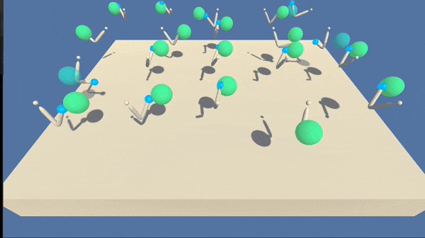

# Project 2 - Continuous Control - Deep Reinforcement Learning Nanodegree

### Introduction

In this project, we use deep reinforcement learning (specifically variations of DDPG) to train an agent to control a double-jointed arm.



There are 20 agents, and each is rewarded with +0.1 for every step that the arm’s hand is in the target location. The goal is to achieve an average score of at least 30 over all agents and over 100 consecutive episodes.

Each agent observes 33 variables corresponding to position, rotation, velocity, and angular velocities of the arm.

The action space consists of four continuous variables for the torque at the two joints.

### Setup

#### Download and install deepRL-continuous-control
```
clone git https://github.com/clzuend/deepRL-continuous-control.git
cd deepRL-continuous-control
pip install .
```

#### Download the Unity Reacher Environment
1. Download the environment from one of the links below.  You need only select the environment that matches your operating system:
    - Linux: [click here](https://s3-us-west-1.amazonaws.com/udacity-drlnd/P2/Reacher/one_agent/Reacher_Linux.zip)
    - Mac OSX: [click here](https://s3-us-west-1.amazonaws.com/udacity-drlnd/P2/Reacher/one_agent/Reacher.app.zip)
    - Windows (32-bit): [click here](https://s3-us-west-1.amazonaws.com/udacity-drlnd/P2/Reacher/one_agent/Reacher_Windows_x86.zip)
    - Windows (64-bit): [click here](https://s3-us-west-1.amazonaws.com/udacity-drlnd/P2/Reacher/one_agent/Reacher_Windows_x86_64.zip)
    
2. Place the file in the project folder. 

3. Depending on your operating system you might have to change the ``REACHER_PATH`` in  `Continuous_Control.ipynb`. 

### Instructions

Open the `Continuous_Control.ipynb` workbook to initiate the environment and train the agents.

The Agent class contains the DDPG agent.

The number of layers (at least one) and their neurons for the actor and the critic networks can be passed in lists to the hidden_sizes_actor and hidden_sizes_critic parameters. The default is ``hidden_sizes_actor = [64,64]`` for the actor, i.e., two layers with 64 neurons each, and ``hidden_sizes_critic = [128, 64, 32]`` for the critic.

```python
agent = Agent(state_size=state_size, action_size=action_size,
              random_seed=0, num_agents=num_agents)
```

The ``Agent`` class additionally has ``show_actor_local()`` and ``show_critic_local()`` methods to visualize the graphs of the networks:

```python
agent.show_actor_local()
agent.show_critic_local()
```

Additional information can be found in the project report: `Report.pdf`
